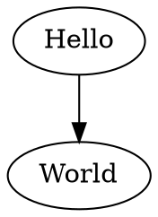
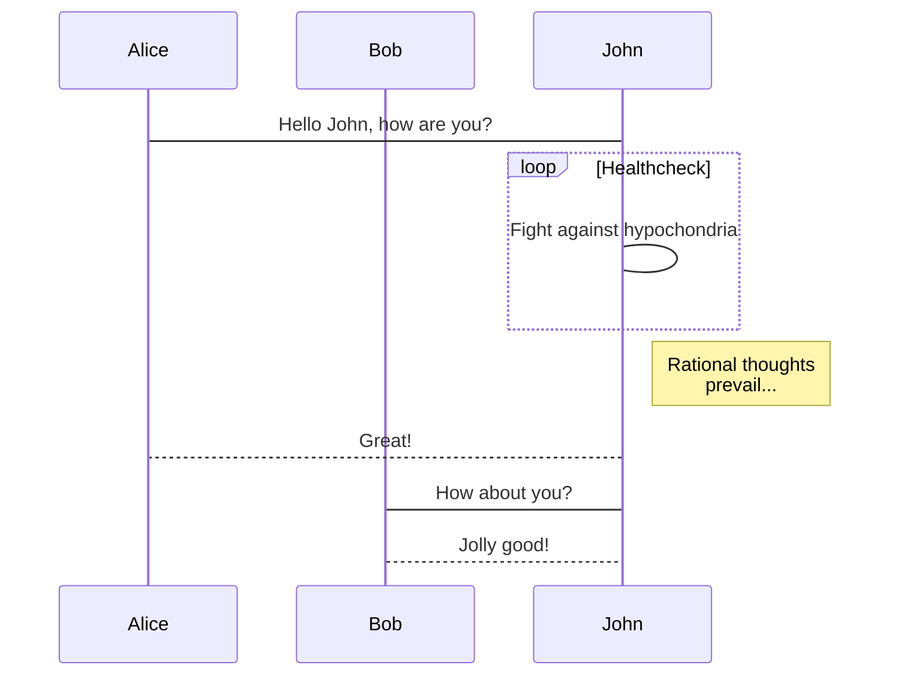

# Documentation generator

This repository contains scripts used to generate the documentation of Lugdunum's projects.

# Requirements

This folder is part of the repository `Lugdunum-Tools` which has to be cloned alongside the `Lugdunum` and `LugBench` repositories for symbolic links in the `./doc` folder to be valid.

# Syntax

The syntax used to generate the documentation is based on Markdown with a few additionnal tweaks. Each section below represents an addtional markup that is available to you when you write documentation for Lugdunum's projects.s

## Info/Warning/Danger dialogs

```md
:::warning
Creates a warning box
:::
```

```md
:::info
Creates an info box
:::
```

As of now, only `info`, `warning` and `danger` are supported. Add additional styles in [pandoc-filters/pandoc-alerts.py](https://github.com/Lugdunum3D/Lugdunum-Tools/blob/master/generate-doc/pandoc-filters/pandoc-alerts.py).

## Linking to doxygen

Auto-linking to doxygen (for now [Lugdunum](https://github.com/Lugdunum3D/Lugdunum)'s only) is available via the following syntax:

```
[`InitInfo`](#lug::Graphics::Graphics::InitInfo)
```

Creates a link [`InitInfo`](https://lugdunum3d.github.io/doc/doxygen/structlug_1_1Graphics_1_1Graphics_1_1InitInfo.html) which links to https://lugdunum3d.github.io/doc/doxygen/structlug_1_1Graphics_1_1Graphics_1_1InitInfo.html

## Raw LaTeX

Raw LaTeX is generally recognized and will be used in the PDF generation, for example `\pagebreak` inserts a page break. However, it is not generally supported and only some commands will be understood and translated to markdown for the website, whereas the general behaviour is to discard any unknown LaTeX code.

## Graphviz

Graphviz diagrams can be automatically generated with a code snippet containing the Graphviz code with the `graphviz` tag.

**Example**



## Mermaid

As with Graphviz, [Mermaid](https://knsv.github.io/mermaid/) graphs can be generated with a code snippet with the `mermaid` tag.



**Note:** Add a comment on the last line to prevent a syntax error from mermaid when the last line doesn't contain a newline.
